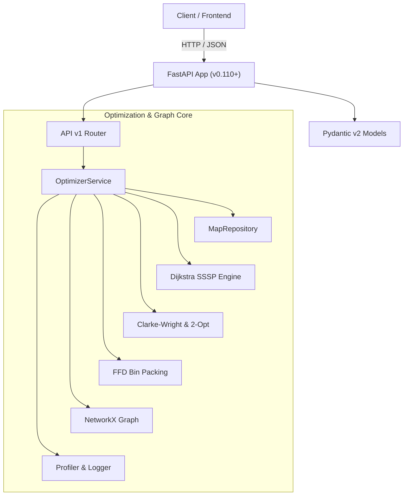
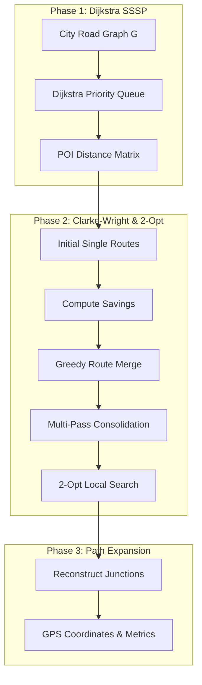
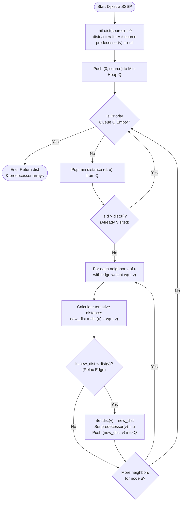
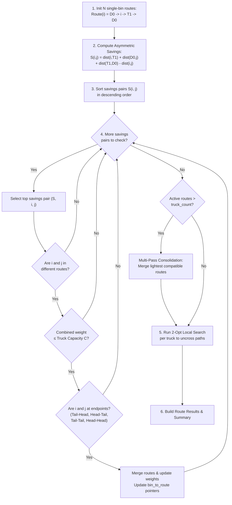
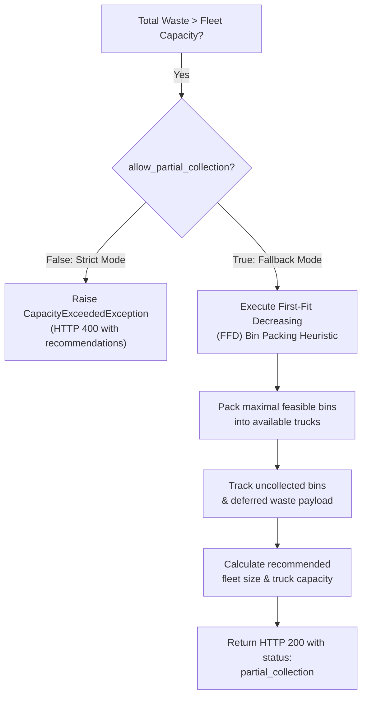
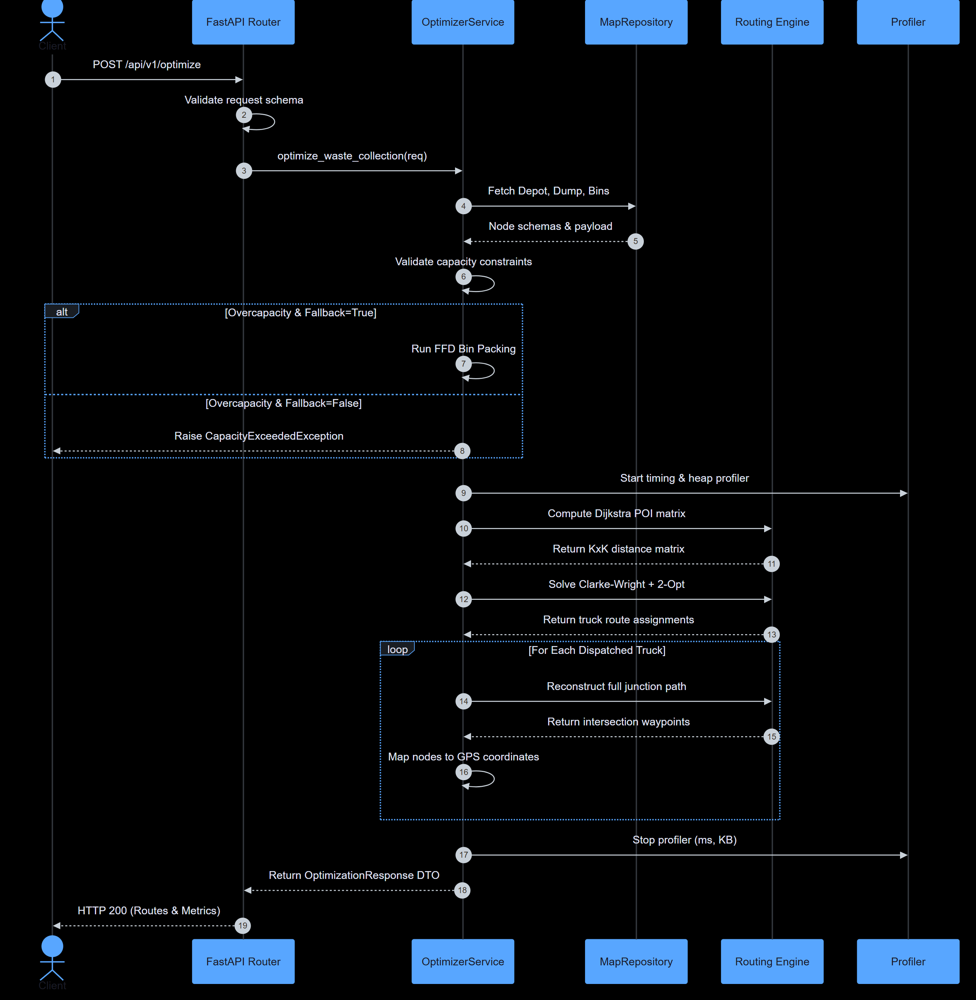
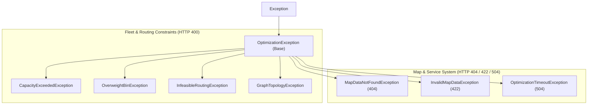

# Smart City Waste Collection Route Optimization Service (Task 5)
## Comprehensive Technical Architecture, Data Structures, Algorithms & API Guide

---

## 1. Executive Summary & System Overview

The **Waste Route Optimization Service (Task 5)** is a high-performance, asynchronous decision-support microservice designed for municipal solid waste management. It provides optimal fleet allocation, capacity enforcement, route sequencing, and turn-by-turn road network path generation for homogeneous vehicle fleets.

### 1.1 Key Capabilities
* **Graph-Based Road Network Modeling**: Models city road layouts as weighted undirected graphs with Start Depots ($D_0$), Waste Disposal / Treatment Facilities ($T_1$), Smart Waste Bins ($B_k$), and Road Intersections ($I_k$).
* **Shortest Path & Matrix Precomputation**: Leverages **Dijkstra's Algorithm** with priority queues to precalculate all-pairs shortest road distances and reconstruct turn-by-turn junction waypoints.
* **Capacitated Vehicle Routing (CVRP)**: Implements an asymmetric variant of the **Clarke-Wright Savings Heuristic** tailored for vehicles departing from a central depot, servicing smart bins, dumping waste at a disposal facility, and returning to the depot.
* **Intra-Route 2-Opt Local Search**: Refines vehicle visiting sequences to eliminate route self-intersections and minimize total traveled distance.
* **Resilient Capacity Fallback & Bin Packing**: Uses **First-Fit Decreasing (FFD)** bin packing to prioritize maximal waste collection during fleet overcapacity while providing dynamic fleet sizing recommendations.
* **Observability & Diagnostics**: Built-in memory profiling (`tracemalloc`), high-resolution execution timing (`perf_counter`), structured logging, and actionable error recovery suggestions.

---

## 2. Technology Stack & Tooling



| Tool / Library | Version | Role & Architectural Purpose |
| :--- | :--- | :--- |
| **Python** | `3.12+ / 3.13` | Core execution runtime. |
| **FastAPI** | `>= 0.110.0` | High-performance asynchronous REST API framework with native OpenAPI/Swagger doc generation. |
| **Pydantic & Pydantic-Settings** | `>= 2.6.0` | Data validation, type enforcement, schema definitions, and environment variable parsing (`.env`). |
| **NetworkX** | `>= 3.2.0` | In-memory graph modeling, connected component analysis, and single-source Dijkstra graph traversals. |
| **Uvicorn** | `>= 0.28.0` | ASGI web server for production and development serving. |
| **Pytest & HTTPX** | `>= 8.0.0` | Automated test suite execution, API regression testing, and TestClient integration. |
| **tracemalloc & time** | Standard Library | Real-time heap memory profiling and microsecond-level execution benchmarking. |

---

## 3. Data Structures Inventory & Analysis

The optimization service employs various fundamental and composite data structures chosen for computational efficiency, memory economy, and rapid lookups.

```
+----------------------------------------+
|      DATA STRUCTURES ARCHITECTURE      |
+----------------------------------------+
| 1. Graph Data Structures               |
|    - Undirected Graph (NetworkX)       |
|    - Adjacency List (nested dict)      |
|    - 2D Distance Matrix (dict[dict])   |
+----------------------------------------+
| 2. Fast Lookup & Indexing              |
|    - Hash Maps (dict)                  |
|    - Hash Sets (set)                   |
|    - Node Schema Cache                 |
+----------------------------------------+
| 3. Heuristic & Routing State           |
|    - Savings Tuples (list/tuple)       |
|    - Min-Priority Heap (heapq)         |
|    - 2-Opt Permutation Arrays          |
+----------------------------------------+
```

### 3.1 Data Structures Breakdown Table

| Data Structure | Implementation | Location | Usage & Purpose | Time Complexity | Space Complexity |
| :--- | :--- | :--- | :--- | :--- | :--- |
| **Undirected Weighted Graph** | `networkx.Graph` | `MapRepository`, `dijkstra.py` | In-memory representation of road junctions and road segments with travel distances ($km$). | Node/Edge Addition: $\mathcal{O}(1)$<br>Lookup: $\mathcal{O}(1)$ | $\mathcal{O}(V + E)$ |
| **Adjacency List** | `Dict[str, List[Dict[str, Any]]]` | `schemas.py`, Map JSON | Raw and serialized representation of road topology connecting source nodes to neighbors. | Neighbor Lookup: $\mathcal{O}(\text{deg}(u))$ | $\mathcal{O}(V + E)$ |
| **Min-Priority Queue (Heap)** | `heapq` (via NetworkX) | `dijkstra.py` | Priority queue used by Dijkstra's algorithm to extract the node with the minimum tentative distance. | Push: $\mathcal{O}(\log V)$<br>Pop-Min: $\mathcal{O}(\log V)$ | $\mathcal{O}(V)$ |
| **2D Distance Lookup Matrix** | `Dict[str, Dict[str, float]]` | `dijkstra.py`, `clarke_wright.py` | All-pairs precomputed shortest road distances between Points of Interest ($D_0, T_1, B_1 \dots B_n$). | Pairwise Query: $\mathcal{O}(1)$ | $\mathcal{O}(K^2)$ where $K = \|POI\|$ |
| **2D Path Lookup Matrix** | `Dict[str, Dict[str, List[str]]]` | `dijkstra.py` | Full sequence of junction IDs along the shortest path between any two POIs. | Path Retrieval: $\mathcal{O}(1)$ | $\mathcal{O}(K^2 \cdot L)$ |
| **Hash Tables / Dictionaries** | `Dict[str, NodeSchema]`, `Dict[str, int]` | `MapRepository`, `OptimizerService` | Instant $\mathcal{O}(1)$ mapping of `node_id` $\to$ `NodeSchema`, `bin_id` $\to$ `weight_kg`, and `bin_id` $\to$ `route_index`. | Get/Set: $\mathcal{O}(1)$ avg | $\mathcal{O}(V)$ |
| **Dynamic Arrays / Lists** | `List[str]`, `List[NodeSchema]` | Across application | Main store for stop sequences, candidate route combinations, coordinates, and sorted savings pairs. | Append: $\mathcal{O}(1)$ amortized<br>Iteration: $\mathcal{O}(N)$ | $\mathcal{O}(N)$ |
| **Hash Sets** | `set` (e.g., `seen_edges`, `visited`) | `MapRepository`, `clarke_wright.py` | Fast membership testing, edge deduplication during bidirectional parsing, and visited tracking. | Membership Test: $\mathcal{O}(1)$ | $\mathcal{O}(E)$ |
| **Structured Tuples** | `Tuple[float, str, str]` | `clarke_wright.py` | Lightweight immutable containers for savings evaluation: `(saving_value, bin_i, bin_j)`. | Creation: $\mathcal{O}(1)$<br>Sorting: $\mathcal{O}(M \log M)$ | $\mathcal{O}(M)$ where $M = K^2$ |
| **Domain Result Object** | `RouteOptimizationResult` | `clarke_wright.py` | Encapsulates per-truck optimized metrics: `truck_id`, `bins`, `stop_sequence`, `weight`, `utilization`, `distance`. | Property Access: $\mathcal{O}(1)$ | $\mathcal{O}(1)$ |
| **Pydantic Model Schemas** | `BaseModel` subclasses | `schemas.py` | Strongly-typed, validated request/response data transfer objects (DTOs). | Validation: $\mathcal{O}(F)$ ($F$ fields) | $\mathcal{O}(\text{payload size})$ |

---

## 4. City Road Network & Graph Modeling

### 4.1 Graph Topology Formulation
The city road network is modeled as a connected, undirected weighted graph:
$$G = (V, E, W)$$
* $V = \{v_1, v_2, \dots, v_n\}$: Set of vertices (nodes) representing geographic locations.
* $E \subseteq \{\{u, v\} \mid u, v \in V, u \neq v\}$: Set of undirected edges representing bidirectional navigable road segments.
* $W: E \to \mathbb{R}^+$: Positive weight function representing the road segment travel distance in kilometers ($km$).

### 4.2 Vertex Classifications
Each vertex $v \in V$ is assigned one of four distinct functional roles:

```
[Start Depot: D0] ------------ [Intersections: I1..Ik] ------------ [Smart Bins: B1..Bn]
                                         |
                                         |
                            [Disposal Facility: T1]
```

1. **Start Depot (`type = "start"`, ID: `D0`)**:
   * The central municipal garage where collection trucks are housed.
   * Trucks depart from $D_0$ at the start of a shift and return to $D_0$ after completing disposal.
   * Waste weight is always $0\text{ kg}$.
2. **Disposal / Treatment Facility (`type = "destination"`, ID: `T1`)**:
   * The municipal landfill, incinerator, or recycling plant.
   * Every truck must visit $T_1$ after collecting waste from its assigned bins to unload its payload before heading back to depot.
   * Waste weight is always $0\text{ kg}$.
3. **Smart Waste Bins (`type = "bin"`, IDs: `B1` to `Bn`)**:
   * IoT-enabled municipal waste collection points throughout the city.
   * Each bin has a positive waste payload $w_i > 0\text{ kg}$ and geographic coordinates $(\text{lat}, \text{lon})$.
4. **Road Intersections (`type = "intersection"`, IDs: `I1` to `Ik`)**:
   * Navigable road transit junctions without waste ($w_i = 0\text{ kg}$).
   * Intersections provide realistic graph connectivity between distant bins and facilities.

### 4.3 Supported Dataset Tiers

| Dataset File | Tier | Total Nodes | Depots ($D_0$) | Disposal ($T_1$) | Smart Bins ($B_k$) | Intersections ($I_k$) | Road Edges | Total Waste Payload |
| :--- | :--- | :---: | :---: | :---: | :---: | :---: | :---: | :---: |
| `city_map_tier1_sparse.json` | Tier 1 (Sparse) | 37 | 1 | 1 | 15 | 20 | 42 | $6,000\text{ kg}$ |
| `city_map_tier2_medium.json` | Tier 2 (Medium) | 87 | 1 | 1 | 45 | 40 | 141 | $18,000\text{ kg}$ |
| `city_map_tier3_dense.json` | Tier 3 (Dense) | 182 | 1 | 1 | 120 | 60 | 423 | $48,000\text{ kg}$ |

---

## 5. Core Algorithms: Theory, Design & Backend Implementation



---

### 5.1 Algorithm 1: Dijkstra's Shortest Path Algorithm

#### A. How Dijkstra Works in General (Theoretical Foundation)
Dijkstra's Algorithm is a greedy graph search algorithm that solves the **Single-Source Shortest Path (SSSP)** problem for graphs with non-negative edge weights.

```
Dijkstra General Logic:
1. Initialize dist[source] = 0, and dist[v] = infinity for all other vertices.
2. Maintain a min-priority queue Q containing pairs (distance, vertex).
3. While Q is not empty:
     a. Extract vertex u with smallest tentative distance dist[u].
     b. If dist[u] > recorded distance, skip (lazy deletion).
     c. For each neighbor v of u with edge weight w(u, v):
          If dist[u] + w(u, v) < dist[v]:
               dist[v] = dist[u] + w(u, v)
               predecessor[v] = u
               Insert (dist[v], v) into Q.
```




**Complexity Analysis**:
* **Time Complexity**: $\mathcal{O}((V + E) \log V)$ using a binary min-heap.
* **Space Complexity**: $\mathcal{O}(V + E)$ for adjacency storage and priority queue.

#### B. How Dijkstra is Implemented in the Task 5 Backend
The backend utilizes Dijkstra's algorithm for two distinct purposes:

1. **Precomputing the All-Pairs POI Distance Matrix (`compute_distance_matrix`)**:
   Instead of computing full all-pairs shortest paths for every intersection node in the city graph ($\mathcal{O}(V^3)$ or repeated SSSP on all $V$), the backend runs single-source Dijkstra **only from each Point of Interest** (Depot $D_0$, Disposal $T_1$, and scheduled smart bins $B_k$).
   ```python
   # app/algorithms/dijkstra.py
   distance_matrix = {u: {} for u in target_nodes}
   for source in target_nodes:
       lengths = nx.single_source_dijkstra_path_length(graph, source, weight="weight")
       for target in target_nodes:
           distance_matrix[source][target] = round(float(lengths[target]), 4)
   ```
   This generates a compact $K \times K$ distance matrix ($K \ll V$) that allows $\mathcal{O}(1)$ distance queries during route optimization.

2. **Turn-by-Turn Road Path Expansion (`reconstruct_full_path`)**:
   When the routing engine determines a high-level stop sequence (e.g., `["D0", "B1", "T1", "D0"]`), the physical road path must navigate through intermediate road intersections ($I_k$).
   `reconstruct_full_path` invokes `compute_shortest_path` between consecutive stop pairs and concatenates the node paths while eliminating duplicate boundary vertices:
   $$\text{Stop Sequence: } [D_0, B_1, T_1, D_0] \implies \text{Full Path: } [D_0, I_1, I_3, B_1, I_4, T_1, I_5, D_0]$$

---

### 5.2 Algorithm 2: Clarke-Wright Savings Algorithm (Modified CVRP)

#### A. How Clarke-Wright Works in General (Theoretical Foundation)
The Clarke-Wright Savings Algorithm (1964) is one of the most widely used heuristic algorithms for the **Capacitated Vehicle Routing Problem (CVRP)**.

```
Classic Clarke-Wright Formulation (Single Central Depot O):
1. Start with N separate routes, one for each customer i: (O -> i -> O) with distance 2 * dist(O, i).
2. Calculate the distance saved if two customers i and j are visited on the same route (O -> i -> j -> O):
   Savings(i, j) = dist(O, i) + dist(O, j) - dist(i, j)
3. Sort all savings pairs S(i, j) in descending order.
4. Iterate through sorted savings and merge routes containing i and j IF:
   - i and j are on different routes.
   - i and j are currently at the endpoints (exterior) of their respective routes.
   - The combined payload does not exceed vehicle capacity C.
```

```
Classic Savings Intuition:
Separate Routes:  (O) ===> (i) ===> (O)  +  (O) ===> (j) ===> (O)   [Cost = 2*d(O,i) + 2*d(O,j)]
Merged Route:    (O) ===> (i) ---------> (j) ===> (O)             [Cost = d(O,i) + d(i,j) + d(O,j)]
Savings:         S(i,j) = d(O,i) + d(O,j) - d(i,j)
```

#### B. How Clarke-Wright is Implemented in the Task 5 Backend (Asymmetric Depot & Disposal)
In real-world municipal solid waste collection, trucks do **not** simply return to the depot after visiting bins. They must transport the collected refuse to a dedicated **Waste Disposal Facility ($T_1$)** before returning empty to the **Start Depot ($D_0$)**.

```
Single-Bin Baseline Route for Bin i:
   (Start Depot: D0)  ───>  (Smart Bin: i)  ───>  (Disposal: T1)  ───>  (Return Depot: D0)
   Baseline Cost(i) = dist(D0, i) + dist(i, T1) + dist(T1, D0)
```

When two independent routes $(D_0 \to i \to T_1 \to D_0)$ and $(D_0 \to j \to T_1 \to D_0)$ are merged into $(D_0 \to i \to j \to T_1 \to D_0)$, the new travel cost becomes:
$$\text{Merged Cost}(i, j) = \text{dist}(D_0, i) + \text{dist}(i, j) + \text{dist}(j, T_1) + \text{dist}(T_1, D_0)$$

#### Asymmetric Savings Formula Derived:
$$\begin{aligned}
S(i, j) &= \text{Baseline Cost}(i) + \text{Baseline Cost}(j) - \text{Merged Cost}(i, j) \\
&= \left[\text{dist}(D_0, i) + \text{dist}(i, T_1) + \text{dist}(T_1, D_0)\right] + \left[\text{dist}(D_0, j) + \text{dist}(j, T_1) + \text{dist}(T_1, D_0)\right] \\
&\quad - \left[\text{dist}(D_0, i) + \text{dist}(i, j) + \text{dist}(j, T_1) + \text{dist}(T_1, D_0)\right] \\
\mathbf{S(i, j)} &= \mathbf{\text{dist}(i, T_1) + \text{dist}(D_0, j) + \text{dist}(T_1, D_0) - \text{dist}(i, j)}
\end{aligned}$$

#### Detailed Step-by-Step Backend Execution:



1. **Initialization**:
   Each bin $b_k$ is placed into its own independent route dictionary: `{"bins": [b_k], "weight": w_k}`.
2. **Savings Computation & Sorting**:
   Compute $S(i, j)$ for all distinct pairs of bins $i \neq j$ and sort descending:
   ```python
   savings.sort(key=lambda item: item[0], reverse=True)
   ```
3. **Merge Feasibility & 4 Endpoint Configurations**:
   For each savings candidate $(S(i, j), i, j)$, check:
   * **Route Disjointness**: `bin_to_route[i] != bin_to_route[j]`
   * **Capacity Enforcement**: $\text{weight}(R_i) + \text{weight}(R_j) \le C_{\text{truck}}$
   * **Endpoint Geometry**: Evaluates four candidate merge orientations to find the minimum distance permutation:
     * *Tail-to-Head*: `seq_i + seq_j` (connecting tail of $R_i$ to head of $R_j$)
     * *Tail-to-Tail*: `seq_i + seq_j[::-1]` (inverting $R_j$)
     * *Head-to-Head*: `seq_i[::-1] + seq_j` (inverting $R_i$)
     * *Head-to-Tail*: `seq_j + seq_i`
4. **Multi-Pass Iterative Fleet Size Consolidation**:
   If the number of active routes after greedy merging still exceeds the available vehicle count `truck_count`, a secondary multi-pass greedy consolidation merges the smallest routes while strictly respecting capacity $C_{\text{truck}}$.
5. **Intra-Route 2-Opt Local Search Optimization**:
   Once bin assignments per vehicle are finalized, the visiting sequence of each individual truck is optimized using 2-opt search.

---

### 5.3 Intra-Route 2-Opt Local Search

#### A. How 2-Opt Works in General
2-Opt is a local search algorithm for the Traveling Salesperson Problem (TSP). It systematically removes two edges from a tour and reconnects the two resulting paths in the opposite orientation if doing so decreases the total route distance, effectively uncrossing crossed paths.

```
Before 2-Opt (Crossing Edge Path):      After 2-Opt (Uncrossed Path):
       (A) --------> (B)                       (A) --------> (C)
              \  /                                    |
               ><                                     |
              /  \                                    v
       (C) <-------- (D)                       (B) <-------- (D)
```

#### B. Implementation in the Task 5 Backend
```python
# app/algorithms/clarke_wright.py
def two_opt_sequence(depot_id, dump_id, bin_seq, dist_matrix, max_iterations=500):
    best_seq = list(bin_seq)
    best_cost = calculate_route_distance(depot_id, dump_id, best_seq, dist_matrix)
    improved = True
    iterations = 0
    while improved and iterations < max_iterations:
        improved = False
        iterations += 1
        for i in range(len(best_seq)):
            for j in range(i + 1, len(best_seq)):
                # Reverse sub-sequence between i and j
                candidate = best_seq[:i] + best_seq[i : j + 1][::-1] + best_seq[j + 1 :]
                candidate_cost = calculate_route_distance(depot_id, dump_id, candidate, dist_matrix)
                if candidate_cost < best_cost - 1e-6:
                    best_seq = candidate
                    best_cost = candidate_cost
                    improved = True
                    break
            if improved:
                break
    return best_seq
```

---

## 6. Capacity Enforcement & First-Fit Decreasing (FFD) Fallback

When the total waste in the city exceeds total fleet capacity ($W_{\text{total}} > N_{\text{trucks}} \times C_{\text{truck}}$) or when individual bins exceed a single truck's capacity ($w_i > C_{\text{truck}}$), the backend provides two distinct operating modes:



### 6.1 First-Fit Decreasing (FFD) Bin Packing Algorithm
FFD is an approximation algorithm for bin packing that achieves a tight approximation guarantee of $\frac{11}{9}\text{OPT} + \frac{6}{9}$.

1. **Sort Bins Descending by Payload**: $w_1 \ge w_2 \ge w_3 \dots \ge w_m$.
2. **Greedy First-Fit Placement**: For each bin, iterate through available trucks $T_1 \dots T_N$. Place the bin into the first truck whose current load plus $w_k \le C_{\text{truck}}$.
3. **Partition Segregation**: If a bin cannot fit into any of the $N$ trucks, it is moved to the `uncollected_bins` list.

### 6.2 Dynamic Fleet Sizing Recommendations
When fallback is active, the response automatically calculates and provides optimal fleet recommendations:
$$\text{Recommended Fleet Size } N_{\text{rec}} = \left\lceil \frac{W_{\text{total}}}{C_{\text{truck}}} \right\rceil$$
$$\text{Recommended Truck Capacity } C_{\text{rec}} = \left\lceil \frac{W_{\text{total}}}{N_{\text{trucks}}} \right\rceil$$

---

## 7. End-to-End Pipeline Execution Flow



---

## 8. Complete API Reference & Endpoint Specifications

Base URL: `http://localhost:8005` or `/api/v1`

### 8.1 Endpoint Summary Table

| Method | Path | Summary | Tags | Key Request Parameters | Response Model |
| :---: | :--- | :--- | :--- | :--- | :--- |
| `GET` | `/health` | Root Service Health Check | `health` | None | `HealthResponse` |
| `GET` | `/api/v1/health` | API v1 Health Check | `health` | None | `HealthResponse` |
| `GET` | `/api/v1/map` | Get Complete City Road Map | `map` | None | `CityMapResponse` |
| `GET` | `/api/v1/map/validate` | Validate Road Network Topology | `map` | None | `MapValidationResponse` |
| `POST` | `/api/v1/map/reload` | Reload or Switch Map Dataset | `map` | `map_path` (Optional string) | `MapReloadResponse` |
| `GET` | `/api/v1/nodes` | Get Road Network Nodes | `map` | `type` (Optional: start, destination, bin, intersection) | `List[NodeSchema]` |
| `GET` | `/api/v1/bins` | Get Smart Waste Bins | `bins` | None | `List[NodeSchema]` |
| `GET` | `/api/v1/depots` | Get Start Depot & Disposal Sites | `facilities` | None | `List[NodeSchema]` |
| `GET` | `/api/v1/fleet/estimate` | Estimate Fleet Sizing | `fleet` | `truck_capacity_kg` (Query int $\ge 100$) | `FleetEstimateResponse` |
| `POST` | `/api/v1/optimize` | Solve Waste Collection Routing | `optimization` | JSON body: `truck_count`, `truck_capacity_kg`, `allow_partial_collection` | `OptimizationResponse` |

---

### 8.2 Detailed Endpoint Specifications

#### 1. `POST /api/v1/optimize`
Execute multi-vehicle route optimization, capacity allocation, and GPS path generation.

**Request Body**:
```json
{
  "truck_count": 5,
  "truck_capacity_kg": 1500,
  "allow_partial_collection": true
}
```

**Success Response (`200 OK`)**:
```json
{
  "status": "success",
  "is_fallback": false,
  "fallback_message": null,
  "summary": {
    "total_distance_km": 848.78,
    "total_waste_collected_kg": 6000,
    "total_waste_available_kg": 6000,
    "collection_coverage_pct": 100.0,
    "trucks_used": 5,
    "total_trucks_available": 5,
    "is_fallback": false,
    "execution_time_ms": 32.52,
    "peak_memory_kb": 193.41
  },
  "truck_routes": [
    {
      "truck_id": "TRUCK-1",
      "collected_weight_kg": 1200,
      "capacity_utilization_pct": 80.0,
      "route_distance_km": 184.86,
      "stop_sequence": ["D0", "B11", "B2", "B14", "T1", "D0"],
      "full_path_coordinates": [
        {"node_id": "D0", "node_type": "start", "lat": 41.43, "lon": -74.05},
        {"node_id": "I2", "node_type": "intersection", "lat": 41.48, "lon": -74.0095},
        {"node_id": "B12", "node_type": "bin", "lat": 41.4817, "lon": -74.0103},
        {"node_id": "I12", "node_type": "intersection", "lat": 41.5061, "lon": -74.046},
        {"node_id": "B11", "node_type": "bin", "lat": 41.6923, "lon": -73.7014},
        {"node_id": "B2", "node_type": "bin", "lat": 41.6738, "lon": -73.6077},
        {"node_id": "I17", "node_type": "intersection", "lat": 41.5845, "lon": -73.6045},
        {"node_id": "B14", "node_type": "bin", "lat": 41.5697, "lon": -73.66},
        {"node_id": "T1", "node_type": "destination", "lat": 41.73, "lon": -73.67},
        {"node_id": "D0", "node_type": "start", "lat": 41.43, "lon": -74.05}
      ]
    }
  ],
  "uncollected_bins": [],
  "uncollected_waste_kg": 0,
  "recommended_fleet_size": null,
  "recommended_truck_capacity_kg": null,
  "warnings": []
}
```

---

#### 2. `GET /api/v1/map/validate`
Validates graph connectivity, component count, and facility presence.

**Sample Response (`200 OK`)**:
```json
{
  "is_valid": true,
  "map_source": "D:\\...\\data\\city_map_tier3_dense.json",
  "total_nodes": 182,
  "start_depots_count": 1,
  "destinations_count": 1,
  "smart_bins_count": 120,
  "intersections_count": 60,
  "total_edges": 423,
  "total_waste_kg": 48000,
  "is_connected": true,
  "connected_components": 1,
  "validation_messages": [
    "SUCCESS: Road network graph is fully connected and navigable."
  ]
}
```

---

#### 3. `GET /api/v1/fleet/estimate`
Calculates the theoretical minimum fleet requirement for all city waste.

**Query Parameters**:
* `truck_capacity_kg` (integer, default: 1500, minimum: 100)

**Sample Response (`200 OK`)**:
```json
{
  "total_bins": 120,
  "total_waste_kg": 48000,
  "truck_capacity_kg": 2000,
  "min_trucks_required": 24
}
```

---

#### 4. `POST /api/v1/map/reload`
Dynamically reloads map data or switches dataset at runtime without restarting the server.

**Request Body**:
```json
{
  "map_path": "data/city_map_tier2_medium.json"
}
```

**Sample Response (`200 OK`)**:
```json
{
  "status": "success",
  "map_source": "D:\\...\\data\\city_map_tier2_medium.json",
  "nodes_loaded": 87,
  "bins_loaded": 45,
  "edges_loaded": 141,
  "total_waste_kg": 18000,
  "timestamp": "2026-09-01T06:35:00.123456+00:00"
}
```

---

## 9. Error Handling, Validation & Diagnostics

The service implements a structured error architecture that ensures every failure responds with structured diagnostic context and actionable suggestions.

### 9.1 Standardized Error Schema (`StructuredErrorResponse`)
```json
{
  "status": "error",
  "error": "CapacityExceeded",
  "message": "Total waste payload (48,000 kg) exceeds total fleet capacity (6,000 kg = 3 trucks × 2,000 kg). Capacity deficit: 42,000 kg.",
  "detail": "Total waste payload (48,000 kg) exceeds total fleet capacity (6,000 kg = 3 trucks × 2,000 kg). Capacity deficit: 42,000 kg.",
  "details": {
    "total_waste_kg": 48000,
    "fleet_capacity_kg": 6000,
    "capacity_deficit_kg": 42000,
    "truck_count": 3,
    "truck_capacity_kg": 2000,
    "recommended_truck_count": 24,
    "recommended_truck_capacity_kg": 16000,
    "allow_partial_collection": false
  },
  "suggestions": [
    "Increase fleet size to at least 24 trucks (with 2,000 kg capacity each).",
    "Increase individual truck capacity to at least 16,000 kg (with 3 trucks).",
    "Enable partial collection fallback ('allow_partial_collection': true) to prioritize high-yield bins within available capacity."
  ],
  "timestamp": "2026-09-01T06:35:00.123456+00:00"
}
```

### 9.2 Domain Exception Hierarchy



---

## 10. Automated Testing & Verification Suite

The service includes a comprehensive test suite in the `tests/` directory with **47 automated tests** covering unit, integration, validation, and boundary conditions.

```
============================= test session starts =============================
platform win32 -- Python 3.13.15, pytest-9.1.1, pluggy-1.6.0
rootdir: task5-optimization-service
collected 47 items

tests/test_health.py ..                                                  [  4%]
tests/test_optimizer.py .............................................    [100%]

======================= 47 passed, 3 warnings in 6.50s ========================
```

### 10.1 Test Categories Breakdown
* **Health Check Tests (`test_health.py`)**: Validates root `/health` and `/api/v1/health` endpoints and UTC timestamp formats.
* **Map & Topology Tests**: Validates node parsing, graph connectivity, component detection, and dynamic map reloading.
* **Algorithm Unit Tests**:
  * Dijkstra shortest path accuracy and pairwise distance matrix symmetry.
  * Turn-by-turn intersection expansion and boundary duplicate deduplication.
  * Clarke-Wright savings computation, merge feasibility, and 2-opt sequence distance reduction.
* **Capacity & Fallback Tests**:
  * Strict mode capacity exceptions (`allow_partial_collection=False`).
  * Fallback mode FFD bin prioritization and coverage metrics (`allow_partial_collection=True`).
  * Overweight bin detection and isolation.
* **Fleet Estimation Tests**: Mathematical validation of $\lceil \text{Waste} / \text{Capacity} \rceil$.
* **Input Validation Tests**: Pydantic edge cases (`truck_count <= 0`, `truck_capacity_kg < 100`, malformed JSON).

---

## 11. Quick Start & Execution Guide

### 11.1 Environment Setup
```bash
# 1. Navigate to task directory
cd task5-optimization-service

# 2. Activate virtual environment
.venv\Scripts\activate

# 3. Verify dependencies
pip install -r requirements.txt
```

### 11.2 Running the Application
```bash
# Start Uvicorn development server on port 8005
python -m uvicorn app.main:app --host 0.0.0.0 --port 8005 --reload
```

### 11.3 Accessing Interactive Documentation
* **Swagger UI Documentation**: [http://localhost:8005/docs](http://localhost:8005/docs)
* **ReDoc Documentation**: [http://localhost:8005/redoc](http://localhost:8005/redoc)
* **OpenAPI Specification**: [http://localhost:8005/openapi.json](http://localhost:8005/openapi.json)

### 11.4 Running the Test Suite
```bash
# Run all automated tests
.venv\Scripts\python.exe -m pytest -v
```
